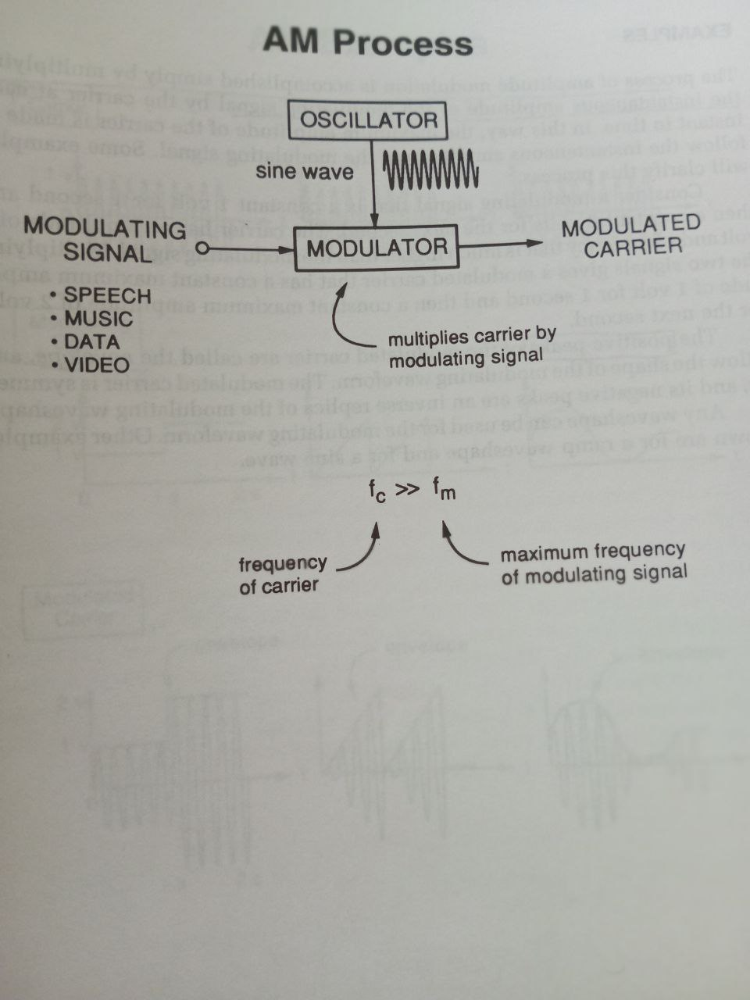

# modulation 

The concept of modulation is essential to communication systems since it enables anumber of different signals to all share the same medium.The combining of the number of signals to share a communication medium by dividing it into different frequency bands for each signal is called **frequency-division multi-plexing**

There are two types of modulation

- amplitude modulation
- frequency modulation

## amplitude modulation
The amplitude of a sine wave is varried in synchrony with the information bearing signal.The sine wave is called **the carrier**.Amplitude modulation is technologically quite simple,and the bandwidthof the amplitude modulated carrier is at **most twice the bandwidth** of the modulating signal.However,an amplitude modulated carrier is very prone to the deleterious effects of additive noise

It's the type of modulation used for **AM radio broadcasting**.the frequency of the carrier is always much higher than the frequency of of the modulating waveform.the carrier frequency can be in the range of **550kHZ to 1,600kHz**.
