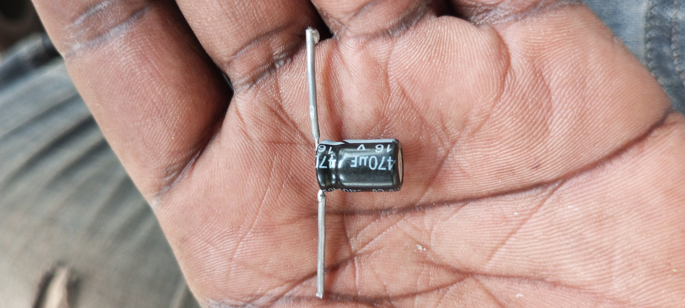

# Building a frequency modulation prototype

## The major purpose and usefulness of the project are as follows:

- To empower communities with skills in fixing faults in devices in their everyday lives.
- To expose me or to make it possible for me to meet people who are interested in these similar thing or field.
- To improve on my existing skills in my current field of electronic repair.
- To build a public artifacts that help me grow a reputation and a career 
- To enable me find mentors to teach me,and I also teach others in my community 
- To learn other peoples skills,and also teach them to my community generation after generation.
- To improve on use of soft wares am relying on and teach the community there after.

## Tools
- Soldering Iron
- screw drivers
-soldering wire,say generally workshop kit
## Materials 
- DIY Plastic Bread Board
- capacitors,10v470uf,50v10uf,0.01mf indicated as 104 ceramics,trimmer capacitors 10-20pf.
- Resistors 1-8watts
- coils 1-4turns(0.8mm)
- Transistors 1619cp or 9018,
- switch or bandselector,
- station box or gang,-speaker(4)ohms.etc

**Feel free to contribut to this**

# Achievements
- it has helped me to master the power supply of an FM transmitter hence making wiring so simple
- mastered every single component and its functionality

# an-fm-radio-transmitter

Provided materials and circuit boards but in this case using locally available material to creat personal circuit board.

# Tools.
- soldering iron
- multimetre
- screw drivers(radio set)
- blade
- solder sucker
- metallic ruler.

# skills

In order to carry out this project;

- one must have a skill in soldering

- familiar with radio wiring

- familiar with electrical transmission components such as capacitors, resistors,coils, ceramic capacitors etc 

- should have knowledge of modulation.

# modulation

The concept of modulation is essential to communication systems since it enables anumber of different signals to all share the same medium.The combining of the number of signals to share a communication medium by dividing it into different frequency bands for each signal is called **frequency-division multi-plexing** 

There are two types of modulation

- amplitude modulation

- frequency modulation

## amplitude modulation

The amplitude of a sine wave is varried in synchrony with the information bearing signal.The sine wave is called the **carrier**.Amplitude modulation is technologically quite simple,and the **bandwidth**of the amplitude modulated carrier is at **most twice the bandwidth** of the modulating signal.However,an amplitude modulated carrier is very prone to the deleterious effects of additive noise

It's the type of modulation used for **AM radio broadcasting**.the frequency of the carrier is always much higher than the frequency of of the modulating waveform.the carrier frequency can be in the range of **550kHZ to 1,600kHz**

## frequency modulation

Is more complicated than amplitude modulation,and the **bandwidth**of a frequency modulated**carrier**can be many times than that of the modulating signal,however the process of demodulating afrequency modulated carrier eliminates much of the deleterious effects of additive noise,this trade off between bandwidth and noise reduction characterises most communication situations.

## multiplexing

**Types**

- space-division multiplexing

- time division multiplexing

- frequency-division multiplexing

*The waveform that carries the baseband signal to another range of frequenciesis called **carrier waveform** or simply carrier,the process by which it's accomplished is called **modulation**.*

The information bearing signal is used to modulate the carrier and so it is sometimes called **modulating signal**.

The information bearing signal is sometimes called **baseband signal**.

The waveform that results from the modulation of the carrier by the baseband signal is called **modulated carrier or the modulated signal**.

The process then has two inputs:

- the baseband (modulating)signal

- carrier

The process of modulation is performed by an electronic device called **a modulator**.

Although the carrier can be any wave shaped, it usually is **a sine wave** that has its amplitude, frequency or phase varried in synchrony with the baseband signal.

[Research from PAGarchitecture library on modulation](Modulation.md)

